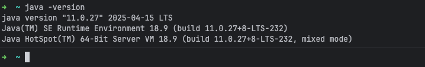
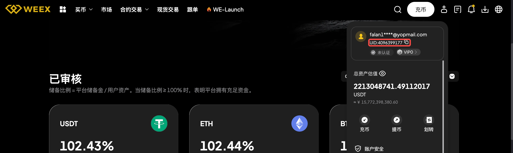
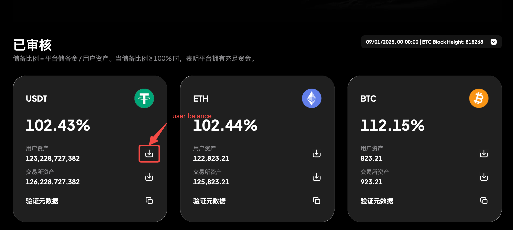
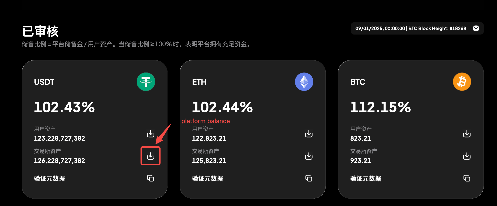
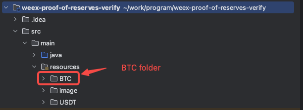
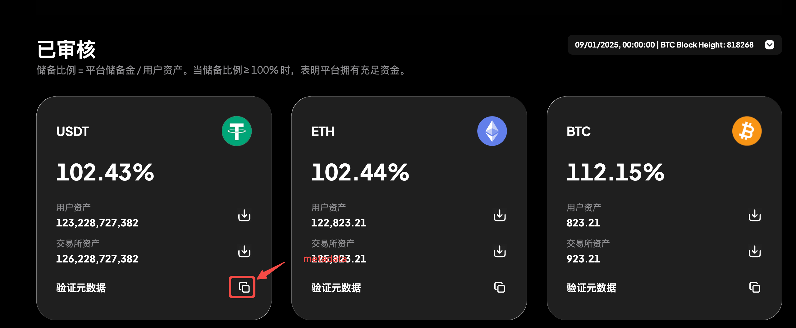
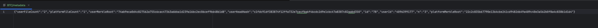
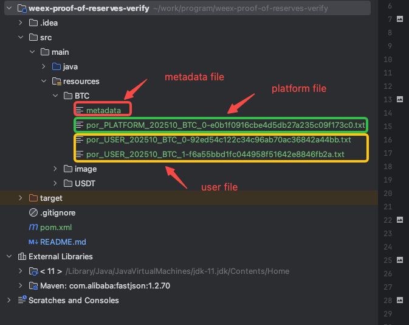
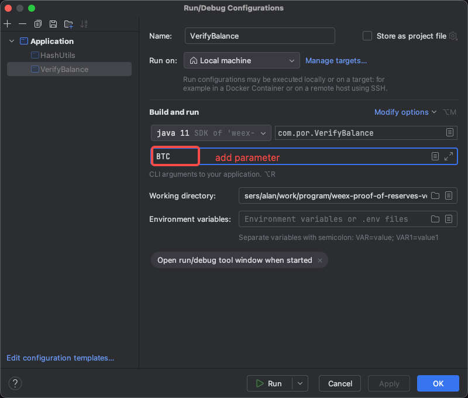
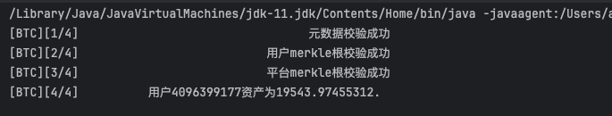

# weex-proof-of-reserves-verify
weex平台资产证明

### prepare

#### 1.make sure Java11(or above) installed on your platform

#### 2.make sure your memory is more than 4G

### verify detail

#### 1.make sure you are on login status


#### 2.download weex-proof-of-reserves-verify from github

```
git clone https://github.com/weexpublic/weex-proof-of-reserves-verify.git
```

### 3.download user balance data


### 4.download platform balance data


### 5.create a folder name asset(such as "BTC") on resources


### 6.create a file named `metadata` and copy metadata on it



### 7.put all data on `BTC` folder


### 7.compile and run
#### parameter


#### result
